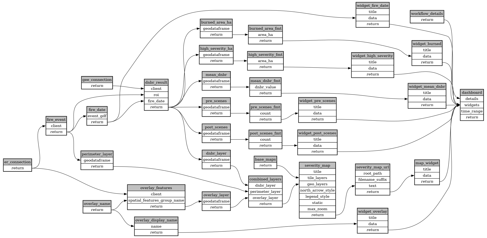

```
# AUTOGENERATED BY ECOSCOPE-WORKFLOWS; see fingerprint in README.md for details

```

```yaml
# fingerprint:
artifacts_sha256_basic: 99a7a28f1d12682f694714a1d01f379a669d7124773033af73376966226a5fc6
artifacts_sha256_strict: 9adf5519381edc8a5e3cf2649a4c299fd1387745e48ed564a38c7dbf2f9d53b9
installed_requirements:
- channel: https://repo.prefix.dev/ecoscope-workflows/
  name: ecoscope-platform
  version: {version: ==2.11.15}
params_sha256: dc0ea67a5569bf7af623b44ccc02fece5d9e7d4100b1852d04e49d78766f346a
spec_sha256: 7e3f18fdce63d3ade87cd7e7df47558048f9ebbf500e706a240856d6628cfcd9

```

# ecoscope-workflows-fire-severity-dnbr-workflow


